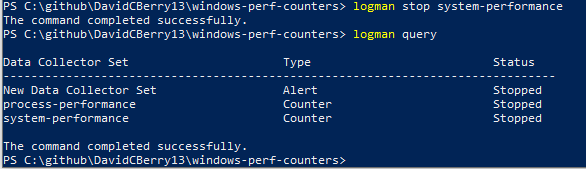

# Windows Performance Counters

This repo contains a collection of scripts for working with Windows Performance Counters and troubleshooting performance issues.

## List all of the Performance Counters on a computer

Use the [typeperf](https://learn.microsoft.com/en-us/windows-server/administration/windows-commands/typeperf) command with the `-q` option to list all pf the performance counters on a machine.

```bat
typeperf -q
```

It is usually easier to write all of the counters to a file so you can view/edit them with a text editor.  This can be easily done by using the `-o` flag and specifying an output file.

```bat
typeperf -q -o counter-list.txt
```

## Create a Data Collector Set with logman.exe

A *data collector set* is a collection of performance counters collected at a specified interval and logged to a specified file.  While it is possible to create a data collector set using the [perfmon](https://learn.microsoft.com/en-us/windows-server/administration/windows-commands/perfmon) GUI, it is faster and much more repeatable to use the [logman](https://learn.microsoft.com/en-us/windows-server/administration/windows-commands/logman-create) command line utility.

### Create a Data Collector Set

The most common way of creating a data collector set using `logman` is to create a text file with the counters you want to collect (one counter name per line) and then specify this file with the `-cf` option to the `logman` executable.

The following example creates a data collector set named *system-performance* that collects data for the counters specified in the *system-counters.txt* file at an interval of once per minute.  Data will be logged to the *c:\perflogs\system-performance-<computer-name>*.  This example uses the PowerShell `$env:COMPUTERNAME` variable to include the computer name in the data file name.

> **Note:** The following command is designed to be executed from a PowerShell prompt as it uses the PowerShell line continuation character (`` ` ``).  To execute in a command prompt, change the backtick (`` ` ``) characters to carrots (`^`)

```powershell
logman.exe create counter `
    -n system-performance `
    -f bincirc `
    -o c:\perflogs\system-performance-$env:COMPUTERNAME `
    --v `
    -a `
    -max 250 `
    -si 00:01:00 `
    -cf system-counters.txt   
```

- The `-n` option is used to specify the name of the data collector set
- The `-f` option is used to specify the type of output file.  `bincirc` is a circular binary file that will write over itself when a certain size is reached.  Other options are `bin` (binary), `csv` (CSV), `tsv` (Tab separated), and `sql` (write to a SQL Server)
- The `-o` option specifies the output location of the data file.  Binary files will have a `.BLG` extension.
- The `--v` option tells logman to not add any version information to the file (this is just one circular file that will wrap around)
- The `-a` option tells logman to append to an existing file if one is already there
- The `-max` option is the maximum file size for the datafile (useful to make sure you don't fill up your disk)
- The `-si` option specifies the sample interval in `hh:mm:ss` format.  This example collects data every 1 minute
- The `-cf` option takes a list of counters to include as part of the data collector set

### Scheduling Perf Counters to be Collected for a specified interval

You can also specify when you want data collection to start and end with the `-b` and `-e` options.  This is useful if you have a batch job that runs on a nightly basis and you want to capture data for only the time period when the job runs

```powershell
logman.exe create counter `
    -n system-performance `
    -f bincirc `
    -o c:\perflogs\system-performance-$env:COMPUTERNAME `
    -max 250 `
    -si 00:00:10 `
    -v mmddhhmm `
    -b <M/d/yyyy h:mm:ss[AM|PM]> `
    -e <M/d/yyyy h:mm:ss[AM|PM]> `
    -cf system-counters.txt   
```

This command uses the `-v` option to attach a date/time timestamp to the file name

### Deleting a Data Collector Set

Use the [logman delete](https://learn.microsoft.com/en-us/windows-server/administration/windows-commands/logman-delete) command to delete a data collector set

```shell
logman delete system-performance
```

## Organizing Data Collector sets

It is generally advantagous to define different data collector sets for different purposes.  For example, it is preferable to have:

- A `system-performance` data collector set that collects system level metrics like CPU, memory, disk, and network
- A `process-performance` data collector set that collects process level metrics (CPU, memory, IO used on a process level)
- Other workload specific data collector sets depending on the role of the server (for example a data collect set to collect SQL performance counters on a SQL Server)

### System Level Performance Counters

A [sample file for system level counters](system-counters.txt) is included in the repository.  It contains the following counters.

| Counter Name                                  | Description |
|-----------------------------------------------|-------------|
| \Processor Information(*)\% Processor Utility | Percent processor utilization.  This value should be correct for multicore systems (unlike the `\Processor(*)\% Processor Time` counter).  Useful for detecting if the CPU is stressed or the system is running out of CPU |
| \Memory\Available MBytes                      | Amount of available memory in MB on the system.  Useful for detecting if the server is using up all of its available memory |
| \Memory\Pages/sec                             | The rate at which pages are read from or written to disk to resolve hard page fault.  A hard page fault is when the needed memory page is not in RAM and has to be fetched from disk.  Sustained high values indicate memory pressure.  |
| \Memory\Page Reads/sec                        | |
| \PhysicalDisk(*)\Current Disk Queue Length    | |
| \PhysicalDisk(*)\% Disk Time                  | |
| \PhysicalDisk(*)\Avg. Disk Queue Length       | |
| \PhysicalDisk(*)\Avg. Disk sec/Read           | |
| \PhysicalDisk(*)\Avg. Disk sec/Write          | |
| \System\Processor Queue Length                | Number of processes waiting to get on the CPU.  High numbers here indicate processes are queuing up and you are CPU constrained |
| \System\Processes                             | Number of processes running on the system |
| \Network Interface(*)\Bytes Total/sec         | Number of bytes being processed by the network interface.  Useful for seeing how much network traffic a system is generating |
| \Network Interface(*)\Output Queue Length     | Helps detect network bottlenecs.  High numbers indicate the network cannot keep up with the data the system wants to send |
| \Network Interface(*)\Packets Received Errors | Netowrk errors.  High numbers here indicate there is something faulty with the network |

### Process Level Performance Counters

If the CPU, memory, disk, or network usage on a system is high, the next logical question is to know what process or processes on that system are consuming those resources.  Process counters help to answer that question.

- A sample set of process counters are provided in the [process-counters.txt](process-counters.txt) file
- Using a `*` in the counter name (as shown below) will capture all processes
- You can also filter to only collect data from certain processes.  For example, `\Process(w3wp*)\% Processor Time` would only capture processes that start with `w3wp*` (the ASP.NET worker process executable in this case)

| Counter Name                                  | Description |
|-----------------------------------------------|-------------|
| \Process(*)\% Processor Time                  | The amount of CPU used by the process.  This number may be greater than 100 in cases where the process is using more than one CPU |
| \Process(*)\ID Process                        | The process id (PID) of the process.  This is useful when you have more than one process with the same name (like the ASP.NET worker process-W3WP) and you need to differentiate between them |
| \Process(*)\Working Set                       | The amount of virtual memory allocated to the process.  Some of this memory may be shared with other processes. |
| \Process(*)\Private Bytes                     | The amount of memory that is private to the process |
| \Process(*)\Handle Count                      | The number of open handles (files) this processes has |
| \Process(*)\IO Read Bytes/sec                 | The amount of disk reads this process is performing |
| \Process(*)\IO Write Bytes/sec                | The amount of disk writes this process is performing |
| \.NET CLR Memory(*)\% Time in GC              | The amount of time a .NET process spent in the garbage collector.  Normally this number is very small.  Consistent high values indicate the program is inefficiently allocating large numbers of objects that then are quickly disposed of. |
| \.NET CLR Exceptions(*)\# of Exceps Thrown / sec | The number of exceptions thrown per second by a .NET process.  Exceptions are expensive to handle, so high values indicate poor coding practices |

## Starting and Stopping Data Collector Set

To see the data collector sets on a server use the `logman query` command

```cmd
logman query
```

This will provide a list of the data collector sets and their status (running or stopped)


---

To start collecting data for a data collector set, use the `logman start` command with the name of the data collector set

```cmd
logman start system-performance
```

The data collector set should now show as running in the output of `logman query`


---

To stop collecting data, use the `logman stop` command with the data collector set name

```cmd
logman stop system-performance
```

The data collector set will now show as stopped



## Starting Perf Counters on System Startup

Data collector sets do ***not*** automatically start collecting data when a system is booted.  The easiest way to start data collection every time the systems boots is to use a Windows Scheduled Task.

```powershell
$Trigger = New-ScheduledTaskTrigger -AtStartup
$Principal = New-ScheduledTaskPrincipal -UserID "NT AUTHORITY\SYSTEM" -LogonType ServiceAccount  -RunLevel Highest 
$Action = New-ScheduledTaskAction -Execute "logman" -Argurment "start system-performance"

Register-ScheduledTask -TaskName "Start System Perf Counters" -Trigger $Trigger -Principal $Principal -Action $Action
```

- This scheduled task will run as the `SYSTEM` user using a `-LoginType` of `ServiceAccount`.  This is neccessary so the data collector set will start without a user needing to login to the computer.
- The `logman` command will execute in an elevated command prompt (`-RunLevel Highest`)
- Note that when using the `New-ScheduledTaskAdmin` cmdlet in PowerShell, the executable that is run (`logman`) and its arguments (`start system-perfromance`) are provided separetly with the `-Execute` and `-Argument` parameters respectively.
- If you have multiple data collector sets, you will need to create a separate scheduled task to start each one
- Specify the name of the data collector set (*system-performance*, *process-performance*, etc) as part of the `-Argument` clause of the scheduled task action

## Converting a binary log file to CSV

It is useful to collect the performance counters into a binary circular file as this is the most efficient format and the file can roll over itself.  But to bring into Excel, you want a CSV file.  Use the [relog](https://learn.microsoft.com/en-us/windows-server/administration/windows-commands/relog) command to convert a binary (.blg) file to a CSV file as follows.

```cmd
relog <binary-file-name> -f csv -o <csv-file-name>
```

## Additional Resources

- [**Capture Performance Logs Using Logman.exe, relog.exe and typeperf.exe**](https://www.youtube.com/watch?v=VNcbOfZWvAA) - YouTube Video by Dell Enterprise Support showing the basics of setting up Performance Counters on a Machine
- [**Two Minute Drill: LOGMAN.EXE**](https://techcommunity.microsoft.com/t5/ask-the-performance-team/two-minute-drill-logman-exe/ba-p/373061) - Blog post quickly summarizing the use of logman to create data collector sets
- [**Hyper-V - Detecting Virtualized Environment Bottlenecks**](https://learn.microsoft.com/en-us/windows-server/administration/performance-tuning/role/hyper-v-server/detecting-virtualized-environment-bottlenecks)
- Ask The Performance Team blog - An Overview of Troubleshooting Memory Issues - [Part One](https://techcommunity.microsoft.com/t5/ask-the-performance-team/an-overview-of-troubleshooting-memory-issues/ba-p/372673) and [Part Two](https://techcommunity.microsoft.com/t5/ask-the-performance-team/an-overview-of-troubleshooting-memory-issues-part-two/ba-p/372679)
